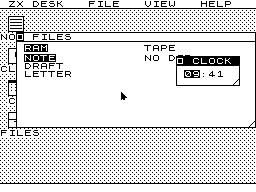
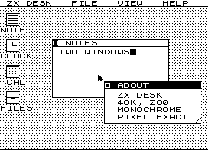
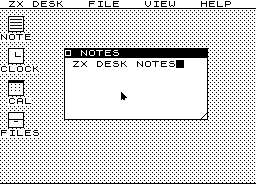
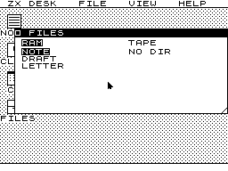
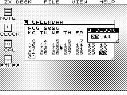
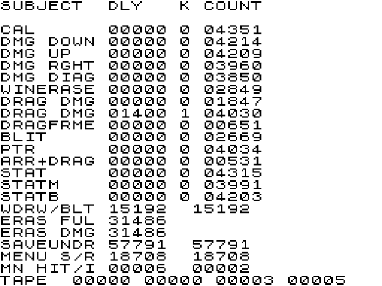

# ZX Desk

A graphical desktop for the ZX Spectrum 48K, written in Z80 assembly.

Overlapping windows with a z order and focus, pull down menus, a heap,
an event queue, a storage layer with swappable backends, dialogues,
controls, a notepad, a clock, a calendar, a two pane file manager, and
a settings panel that actually changes things. It all fits in 48K on a
machine from 1982, and it can drag a window inside a single 69,888 T
state frame.

It runs on the real thing, not just an emulator.

---

## Why

Back in the eighties I wanted an Atari ST and couldn't afford one.
What I really wanted was
[GEM](https://en.wikipedia.org/wiki/GEM_(desktop_environment)): the
desktop, the windows, the menu bar that was always there, the feeling
that the machine was a place rather than a prompt. I had a Spectrum
instead, and I spent a long time wondering how much of that you could
do on it. I started writing bits of it, and never finished.

So this is that, finished. It isn't a port of GEM and doesn't pretend
to be. It's what the idea turns into when you push it up against a
3.5 MHz Z80, 48K of RAM, a one bit display with attribute clash, and a
video chip that steals cycles from the CPU while it paints. A lot of
the answers turned out to be more interesting than the question, and
nearly all of them came from measuring the machine rather than
reasoning about it.

It's a fun project and a labour of love, and the reason it's written
up at this length is that the measurements are the useful bit. If
you're building something on this hardware, the numbers below cost me
a lot of evenings. They're yours.

---

## What it does today

| | |
|---|---|
| **Windows** | Overlapping, z ordered, movable, resizable, with title bar, close box and grip. Focus is the front of the z order, so raising and focusing are one action. |
| **Menus** | A permanent menu bar with pull downs, save under, and hit testing. |
| **Input** | Kempston mouse, Kempston joystick, and the full keyboard matrix decoded across three tables with repeat. All of it arrives as events. |
| **Events** | A sixteen slot ring. The main loop contains no window specific code. |
| **Storage** | A registry of backends behind six vectors. RAM, tape (via the real ROM loader), and the 128K's spare banks as a RAM disk. [esxDOS](https://esxdos.org/) has a reserved id. |
| **Memory** | A real heap with an owner byte, 8,111 bytes, allocating window buffers sized to their windows. |
| **Applications** | A descriptor with init, event and paint, plus per instance state swapped in and out. Notepad, clock, calendar, commander, about. |
| **Application interface** | A jump table at `$8000`, 44 slots, with slot n at `$8000 + 3n`. The clock, the calendar, the notepad and the commander all work through it and name no desktop global. |
| **Loadable apps** | An app is a file: a header, an image assembled at origin nought, and a relocation table. The desktop loads it into the heap from RAM, a 128K bank or tape and runs it in a window. See [Writing an app](#writing-an-app). |
| **Persistence** | Settings written to storage with a magic byte and a version, and read back at boot. |

Screenshots:

| | |
|---|---|
|  |  |
| Two windows, z ordered | The notepad, with the Sinclair style shift-reporting cursor |
|  |  |
| Two pane commander, over devices rather than directories | Clock and calendar |

---

## Running it

The toolchain is local and small: [pasmo](https://pasmo.speccy.org/)
0.5.5, built from source into `tools/`.

    ./build.sh                  assemble src/zxdesk.asm to build/zxdesk.tap
    ./run.sh                    build and load onto the machine
    MACHINE=128 ./run.sh        the same on a 128K, and put the setting back

esxDOS runs here too, on an emulated DivMMC with a 64MB card image.
`tools/` isn't in the repository because pasmo, the emulators and the
esxDOS ROM aren't mine to redistribute, so you'll need to build the
image yourself from an esxDOS release and a DivMMC card image. Once
it exists, launch `tools/esxdos/esxdos.szx` and esxDOS is already
resident; `Machine > NMI` gets you its file browser.

Build flags, all passed through `--equ`:

    DEMO=1 ./build.sh           a self dragging build, for reproducible captures
    NOWAIT=1                    with DEMO, the same drag with no beam scheduler
    SCRIPT=1 ./build.sh         drive the desktop from synthetic input
    MOUSETEST=1 ./build.sh      the raw Kempston mouse diagnostic

`build.sh` must pass `--name` explicitly, because pasmo takes the tape
header name from the output path exactly as written and would
otherwise put `build/zxde` in the header. It also refuses to build a
tape if the code has grown into the buffer region, because that overrun
is silent otherwise: the first window grab writes over the program and
a few seconds later the machine drops into BASIC with an unrelated
error.

**Dragging a window under Fuse needs the space bar, not the mouse
button.** Fuse for macOS, 1.9.2, stops delivering Kempston mouse
movement while a button is held, so the pointer freezes at the moment a
drag begins and the window never follows. Point at the title bar, hold
SPACE, move, release. The mouse is fine for everything else and the
buttons themselves register correctly; it is only movement that stops.

This is the emulator, not the desktop, and `MOUSETEST=1` is how I
proved it: it reads the mouse ports once each with nothing between the
port and the screen, and the counters still stand still while a button
is down. `RiBtn` in `ReadInput` is what makes SPACE work, and it's
there so the desktop is usable on a machine with no mouse at all. A
real Kempston mouse drags normally.

`SCRIPT=1` is the one worth knowing about. It drives the desktop from a
list of synthetic input events instead of the mouse, so an interaction
(open a menu, pick an item, drag the window over another one, type
into the field, save) runs the same way every time and can be compared
against the last run rather than watched.

---

## How it is built

From the bottom up.

**Device layer.** `DevFillRect`, `DevFillDesk`, `DeskFillCol`,
`AddrAt`, `BlitRect`, `RectGrab`. Everything above works in byte
columns and pixel rows and never touches the screen's third and
interleave layout directly. This is the boundary a port swaps out, and
I drew it on day one for exactly that reason.

**Frame discipline.** The main loop halts on the interrupt, does all
pointer work in the top border, waits for the beam if the window
moved, redraws, then reads input and dispatches at the end of the
frame. Input goes last so that the cost before the beam wait is
constant, which is what makes the scheduler exact.

**Event queue.** A sixteen slot ring of four byte events. `EvPoll`
turns raw input into pointer moves, button presses and keys; `EvDispatch`
drains it through a handler table.

**Hit testing.** A five byte row per control, front to back in z
order, `$FF` terminated, refilled from the model before every search so
there is no second copy of the window position to go stale. A closed
menu gets a height of zero, which can never match, so `HitTest` has no
special case for it.

**Transient surfaces.** A four deep arena, each surface up to 16 by 96,
pushed and popped. Two stacks rather than one, because the pixels under
a menu are pushed by something that has no panel record at all.

**Windows.** A record swapped into a live copy, the same trick as the
panel record, because the window position is referenced ninety three
times across six files. The z order is also the paint order reversed
and the hit test order.

**Storage.** A registry of backends, each a fourteen byte row of id,
capability bits and six entry points. The six operations are hand laid
`JP` instructions whose operands are patched on selection, so dispatch
costs ten T states and clobbers no registers.

**Controls.** A panel is a stack of rows and every control is a row, so
a row's index is three shifts rather than a search. Four types, of
which the useful one is a cycle: a checkbox is a cycle whose limit is
two, and a radio group is a cycle whose limit is N. The settings panel,
the file list and the save box are all the same code with different
tables.

### The memory map

    $6000-$7E45   the slow region: panels, the calendar, the file
                  panels, the desktop setup, the commander, the
                  app loader
    $7E46-$7FFF   free, 442 bytes, contended
    $8000-$B47E   the fast region: everything else, starting with
                  the application interface's jump table
    $B47F-$BCFF   free, 2,177 bytes
    $BD00         stack top
    $BDBD         interrupt handler
    $BE00-$BEFF   interrupt vector table
    $C000-$C63F   the RAM disk, its directory, and the tape buffer
    $C640-$C750   the live notepad state
    $C751-$DF50   four transient surfaces
    $DF51-$FEFF   the heap, 8,111 bytes: window buffers, window
                  state, and the loaded app
    $FF00-$FFFF   deliberately unused

Two things in that map are worth explaining.

The slow region exists because the ULA steals cycles below `$8000`
while the display is being painted, so code there runs perhaps a third
slower. The rule for it is one line: nothing in it may run inside a
frame. Nothing there is on the drag path, the pointer path or in the
interrupt, and the timings were unchanged to the T state across
the move. It starts at `$6000` rather than at the top of the system
variables because the tape loader indexes the system variable area
through IY and the BASIC loader itself lives just above it, and a CODE
block that overwrote the program doing the loading would be a novel way
to fail.

The heap stops a page short of the top of memory rather than at
`$FFFF`. Every walk computes the next block as address plus header plus
size, and a block ending at `$10000` would wrap to nought and compare
as below the base of the heap. Stopping at `$FF00` costs 256 bytes of
8,367 and removes the entire class of failure.

---

## What was measured

This is the part I'd want if I were reading someone else's repo.
Every figure below was measured by running the code and timing it
against the machine's own clock. None of it comes from counting
instructions, and the few claims that are derived say so.

### The clock you can trust

The 48K interrupt period is exactly 69,888 T states and nothing a
program does can move it, so it is the only usable clock on the
machine. So a timing run syncs on `HALT`, optionally delays a known
number of T states to place the routine at a chosen point in the frame,
calls it, then counts turns of a sixteen T loop until the next
interrupt. Comparing against an empty calibration run cancels every
fixed overhead:

    cost = (K - K0) * (69888 - 118) - 16 * (C - C0) - delay

118 T is the exact cost of the returning interrupt path, counted
instruction by instruction. It is exact rather than estimated because
the handler, its variables, the counting loop and the stack all live
above `$8000`, where the ULA never steals a cycle. Only the routine
being timed touches contended memory.

Measured blind against three delays of known length:

| nominal | measured | error |
|---|---|---|
| 2,599 T | 2,592 T | −7 T |
| 51,999 T | 52,000 T | +1 T |
| 103,999 T | 103,994 T | −5 T |

Worst error is 7 T in 104,000, or 0.007%. The third crosses a frame
boundary, which is what confirms the 118 T figure.

### Contention costs 14.7%, not 50%

Every budget in the project started from a pessimistic 50% penalty on
screen writes, taken from the folklore. Sweeping a 1,024 byte fill
across the frame:

| start | cost |
|---|---|
| top border | 11,744 T |
| 10,399 T | 12,913 T |
| 20,799 T | 13,441 T |
| 31,199 T | 13,473 T |
| 41,599 T | 13,441 T |
| 51,999 T | 12,369 T |
| bottom border | 11,745 T |

The two border figures agree to 1 T, which is the uncontended cost. The
worst case inside the display is 13,473 T. That is 14.7%, or about
1.7 T per contended byte written. Budgets built on the 50% figure are
roughly a third too conservative, and mine were.

### Half the cost of drawing a window is three short strings

`WinDraw` split into its four phases and each timed separately. The
phases sum to within 330 T of the whole, which is the four call and
return pairs plus the sixteen T counting granularity.

| phase | top of frame | mid display | share |
|---|---|---|---|
| text | 35,872 T | 35,969 T | 50% |
| edges | 19,552 T | 19,841 T | 27% |
| fills | 14,688 T | 16,641 T | 21% |
| close box | 832 T | 849 T | 1% |
| **whole** | **71,274 T** | **73,099 T** | |

Twenty seven characters of title and body text, at roughly 1,330 T
each. The fills, which I had assumed were the problem, are a fifth of
it. Optimising the fill would have bought a few per cent of a drag
frame and I'd have spent a week on it.

### A benchmark that measured the wrong thing

An earlier note recorded the cell aware push fill at 7.4 T per byte.
The real routine costs 11.5 T per byte, 54% more. The benchmark had
measured the technique; the routine carries per row address arithmetic
the benchmark never paid. Of the 183 T a row costs, 88 T is the push
chain actually writing pixels and 95 T is the register exchange, the
address step, the cell boundary test and the loop.

Over half the cost of the fastest fill on the machine is not writing
pixels. That generalises: on this processor, per row overhead is the
thing to attack, not per byte throughput.

### Interrupts are lost, not deferred

This is the one I'd most like other people on this hardware to know
about, because it produces a fault that looks like anything except its
cause.

The fills held `DI` for their whole run, because SP walks through
screen memory and stops being a stack. The received wisdom is that this
delays the interrupt. It does not. The Spectrum asserts INT for only
32 T states and then withdraws it, so a `DI` window that covers those
32 T destroys the interrupt rather than postponing it.

It was observed before it was understood. A fill placed at 62,399 T
into the frame reported crossing no frame boundary when it plainly
crossed one. Rescoring it as a lost interrupt gives 11,745 T against
11,744 T for the same fill in the top border, and the two agreeing to
1 T is what confirmed the diagnosis.

Then it was measured properly. With an interrupt injected after every
single instruction of an 8 by 24 fill, the interrupt was refused at 458
of 500 instruction boundaries in one fill routine and 710 of 752 in the
other.

**The obvious fix does not work.** Re-enabling interrupts between rows
sounds right and fails, because the interrupt is not pending, it is
gone. An `EI` window a few T states wide, once every 236 T, catches it
about one row in thirty. Making the `DI` region short is not the same
as making it absent, and only absent is a fix.

**What works is owing the last push.** The fills now run with
interrupts enabled throughout. What `DI` was protecting was SP, so the
fix is to guarantee that the two bytes of return address always land
somewhere that is about to be overwritten anyway. SP takes two kinds of
value: inside the rectangle, where a push writes exactly what the
chain's next push will write, and the low point after the last push of
a row, which the chain never returns to. So the chain is made one push
shorter than the row, and the leftmost two bytes are **owed** — paid one
iteration later, once SP has moved into the next row and can no longer
reach them.

Afterwards: 0 of 607 and 0 of 904 instruction boundaries destroy the
interrupt, the rectangle is byte for byte identical every time, nothing
outside it is touched, and the screen checksums are unchanged
either side of the change.

| | before | after | |
|---|---|---|---|
| 16×96 rectangle fill | 17,414 T | 22,068 T | +48 T a row |
| 16×96 desktop fill | 25,351 T | 30,125 T | +50 T a row |

Both fills have since learned to cope with an odd width, which used to
leave its third column unpainted. An even width pays one untaken jump
for that, 7 T a call. That figure is derived, not measured: the jump
sits above `$8000` and runs before anything touches the screen. The
fill timings in this section and in the contention sweep were taken
before the change, so they're 7 T low per call.

That's a real cost, and it's worth it. The drag path is mostly the
column fill, which writes through HL, never touched SP and was never at
risk.

### The watchdog that was caught by the thing it was built to catch

A frame watchdog counts interrupts in the handler and frames in the
main loop; the difference is frames dropped. The handler is the awkward
half, because it fires inside a fill where the stack is not a stack.

The first version borrowed IX and counted with `INC (IX+0)`, and the
interrupt sweep above failed on its first run. That instruction sets
the flags, and a fill holds a live carry across the address step that
finds the end of a row and the branch that decides whether the row
crossed a boundary. An interrupt in that gap stole the carry and the
row stepped to the wrong address.

`INC IX` is a sixteen bit increment and sixteen bit increments leave
the flags alone. So the counter is a word, the handler is transparent,
and it costs 104 T fifty times a second with not one flag or register
altered. The roadmap had predicted that a watchdog would have caught
the interrupt bug earlier. What actually happened is that the interrupt
test caught the watchdog.

**Letting the handler push is also a dead end.** A handler that pushes
AF uses four bytes below SP rather than two, so the owed region has to
double and every row pays another 22 T.

### Getting a drag inside one frame

The starting position was hopeless: a full erase and redraw of a window
cost 96,010 T against a frame of 69,888 T. That is 137% of a frame, and
it is why dragging ran at 25 Hz. Four changes, in order, each measured:

| change | effect |
|---|---|
| **Off screen buffer.** Compose once into a buffer, blit per frame. The expensive work is composition, not transfer. | redraw 71,274 T → 26,048 T |
| **Faster text.** Rewriting the pixel text renderer. | 1,307 T → 622 T a character, 2.10× |
| **Damage rectangles.** Erase only the strip the window has vacated, not the whole window. | erase 19,664 T → 1,456 T |
| **A narrow desktop fill.** Two bytes straight through HL with the pattern held in registers, unrolled four ways so no row works out its phase. | single column strip 14,256 T → 5,712 T |
| **Chasing the beam** rather than waiting for it to clear the whole window. | a further 16,128 T |

A drag frame now ends at **59,858 T**, inside the frame, and dragging
runs at 50 Hz.

The beam scheduler counts scan lines rather than T states, because one
line is exactly 224 T and the top border is exactly 64 lines, so the
target is an eight bit addition rather than a division. It measured
36,576 T for 163 lines against 36,353 T counted by hand.

The text rewrite is worth a note because measuring it proved both of
my guesses wrong. The address routine was called once per character, not
once per pixel row, and crossing a cell boundary cost nothing. The real
costs were 232 T re-testing an inversion flag on every pixel row, 344 T
on eight calls to a row stepping routine, and 126 T recomputing an
address that was one byte to the right of the previous one. The
replacement makes the inversion a self modified `XOR` operand set once
per string, walks one address across the whole string, and splits the
eight pixel rows either side of the single cell boundary they can
cross.

**Damage aware blitting does not follow.** When a window moves
vertically every row still has to be written, because the pixels
underneath are the same window at the wrong offset. Damage shrinks the
erase only. A per row signature built at grab time would let uniform
interiors be skipped, worth perhaps 9,700 T on this window, but it only
pays for windows with large flat areas. Held in reserve rather than
rejected.

**The stack based blit does not follow either.** Popping eight register
pairs from the buffer and pushing them to the screen costs about 212 T
a row against `LDI`'s 256, but the pointer bookkeeping needs `LD (nn),SP`
and a reload each row, which puts it back at roughly 304 T against the
current 327. It also needs `DI`, which reintroduces the lost interrupt
hazard, and running it with interrupts on via the owed push technique
costs 48 T a row, which makes the arithmetic worse rather than better.

### The interrupt is not 50 Hz

The 48K frame is exactly 69,888 T at 3.5 MHz, so the rate is 50.0801 Hz.
Ticking a second every fifty interrupts gains 0.16%, which is two
minutes eighteen seconds a day. The clock instead makes a second fifty
interrupts and, every so often, fifty one, decided by accumulating a
hundredth each second and demanding an extra interrupt when it carries.
Driven for an hour it takes 180,287 interrupts against a true
180,288, which is half a second a day.

On a 128K the frame is 70,908 T at 3.5469 MHz, so the rate is 50.0211 Hz
and the addend differs. Machine detection has already run by the time
the clock initialises.

What the clock counts is the interrupt counter that the watchdog built
to notice dropped frames, read as a difference since the last look, so
a frame the main loop missed still advances the time — because the
interrupt happened whether or not anything was listening.

### A calendar with no division

Day of the week is counted forward from 1 January 1980, a Tuesday,
rather than by [Zeller](https://en.wikipedia.org/wiki/Zeller%27s_congruence)
or [Sakamoto](https://en.wikipedia.org/wiki/Determination_of_the_day_of_the_week#Sakamoto%27s_methods),
because both of those want division
by 4, 100 and 400 and this machine has no divide instruction. A year is
1 modulo 7, or 2 in a leap year, so walking a century is at most a
hundred additions, and it happens once per repaint.

The century rule never fires, and that is a property of the range
rather than a corner being cut: 1980 to 2079 contains one century year
and 2000 is a leap year, so within that range a leap year is exactly a
year divisible by four. All 1,200 months it can display are checked
against Python's `datetime` for both the first weekday and the length.

---

## Bugs worth writing down

Every real discovery in this project came from running code, not from
reading it. These are the ones that generalise.

**A bug that repaired itself in front of me.** The heap's free routine
had one `DEC HL` too many, so it cleared the used flag and then wrote a
nought into the high byte of the block's size. The heap should have
been ruined on the first free. It was not, because the coalescer then
found a short free block, looked past it into a payload that happened
to be all zeros, read those zeros as an empty free block, and absorbed
them four bytes at a time until it arrived back at exactly the true
total. Every number agreed. It only surfaced when a freed block held
something other than zeros — the first block big enough to have held
window pixels — and then the walk went into the pixels and the heap
came back 2,619 bytes short.

The lesson is about the test rather than the allocator. A heap test
that frees blocks it never wrote to is testing a zero fill. It writes
`$A5` over the payload before freeing now, and asserts on the header
directly rather than through a total that can heal.

**The register that carries the answer must not be the register that
carries the argument.** This family accounted for five separate bugs.
A search routine held its index in `AF` across the compare that decided
whether it had found anything, so the `POP AF` restored the flags from
before the compare and it never matched. A digit printer used B to
count tens and was called twice with the other digit in B, so the
calendar's year came out as 2050. Two routines ending in `LDIR` return
with A clobbered and BC zero, which produced a second window that was
an exact copy of the first and a panel whose row count was nought.
Loading a `DJNZ` counter before calling a routine that uses B as a row
counter makes the loop run 256 times, which has now happened twice.

On the Z80 the flags are a register too. If a value must survive a
call, it goes in memory or on the stack. That rule is not learnable as
"watch out for B".

**A row step that subtracts only from E.** The blit did this from the
day it was written. The `LDI`s advance DE sixteen bits, so when a
rectangle's row start plus its width crosses 256, D has already been
incremented and incrementing it again puts the next row a page too
high. The only window in the system lived at column 8 and was eight
bytes short of crossing, so it never showed until a second window moved
to column 16. Anything walking a rectangle a row at a time has to
handle the borrow.

**A number that reads backwards.** Timings are taken by counting a
sixteen T loop until the next interrupt, so a slower routine leaves
*fewer* turns. That was misread twice in one session, once reporting a
16 T saving as a 1 T loss, and once reporting a 1,216 T cost as a 76 T
saving — which meant a real regression went unnoticed for being
displayed as an improvement. Anything that reports a derived quantity
should report it in the units people will reason in.

**A corrupt block size hangs the machine rather than failing.** Every
heap walk computes the next block as address plus header plus size, and
a garbage size wraps past `$FFFF`, lands below the base and compares as
still inside the heap, so the walk loops forever. Nothing can produce a
garbage size now, so no guard was added, but it is the shape of the
next failure and it is worth knowing it presents as a freeze.

**Earlier, and in the same spirit:** an LFSR shifting the wrong
direction gave a period of 71 instead of 65,535; a register clobber
rendered the wrong card in the patience game that was this project's
proving ground; a raster timing bug made the pointer invisible in the
upper half of the display on real hardware but not in the emulator; and
a sign bit underflow teleported windows to the top of the screen the
moment Y exceeded 127.

---

## How the work was done

Every piece of work went through the same three passes, in one
sitting.

1. **Research.** Find the prior art before writing anything. The
   Spectrum demoscene, the ULA and floating bus documentation, the
   esxDOS API notes, the Next register list. Half of these problems
   were solved by somebody in 1987, and the demoscene answer is usually
   faster than the textbook one.
2. **Build.** The smallest thing that can be measured, with the way to
   measure it committed alongside the routine.
3. **Critique.** Argue against the result before accepting it. Look for
   the clobbered register, the boundary case at the screen edge, and
   the figure from a previous session that's no longer true.

I tried to play three parts in every session: the critic who argues
the change is wrong, the researcher who goes looking for the 1987
answer, and the measurer who won't accept a performance claim without
a timing or a correctness claim without a screen checksum.

Three rules that earned their place:

- **It isn't done because it looks right on screen.** The pointer that
  vanished in the upper half of the display looked right on screen.
- **Anything that couldn't be observed directly is labelled derived,
  not measured.** Raster behaviour especially, which is why every
  raster derived claim in this repository says so. That distinction is
  what eventually explained the invisible pointer.
- **One commit per verified piece of work, with the acceptance numbers
  in the commit message.** The numbers in this document are the ones
  from those commits.

---

## Writing an app

An app is assembled on its own, against one include, and loaded by the
desktop at run time. Nothing in it knows an address inside the desktop
except the jump table, which is why the table is append only.

    ./build.sh && ./mkapi.py
    ./mkapp.py examples/counter/counter.asm build/counter.zxa
    ./mkapp.py examples/counter/counter.asm build/counter.zxa \
        --tap build/zxdesk.tap COUNTER

The first line writes `api/zxdesk.inc` from the build: the 44 slots,
the key codes, the storage constants and the descriptor offsets. The
second assembles the example. The third also appends it to the tape
image, after the desktop, so FILE, LOAD with FROM set to TAPE finds it.
In the commander, ENTER on an app file runs it and ENTER on anything
else still opens it in a notepad.

`examples/counter/counter.asm` is the whole of a working app in 139
bytes. The shape is:

                include "zxdesk.inc"
                org     APPORG

                defw    1               ; bytes of state per window
                defw    Count           ; where it lives while in use
                defw    Init, Draw, Key ; any of these may be nought
                defw    Title
                defb    10, 60, 12, 36  ; column, row, width, height
                defw    0, 0, 0         ; close, scroll, scroll to

The descriptor has to come first, because the loader copies the first
22 bytes of the image and calls it the app. `Draw` paints inside the
window with `ApiWinPrint`, where B is pixel rows below the title bar
and C is columns in from the left border, so the app never asks where
its window is. `Key` gets the key in A. To repaint after a key, lift
the pointer, clear, draw, and hand the window back:

                call    ApiPtrRestore
                call    ApiWinClear
                call    Draw
                call    ApiWinGrab
                call    ApiPtrSaveBg
                jp      ApiPtrDraw

**The file.** Eight bytes of header: `ZXA`, the interface version the
app needs, the image length, the relocation count. Then the image,
then one word per relocation, each the offset of a word in the image
that holds an address. `mkapp.py` finds those by assembling at two
origins and comparing, then assembles at a third to prove the list is
complete, which also catches the one thing that can't be relocated: an
instruction that takes half an address.

**Where it lives.** In a heap block, relocated as it loads. A 48K has
no spare address range to promise an app, and the heap is the only
memory there is, so the app goes wherever the heap has room. On a 128K
the spare banks are a place to load from rather than a place to run:
they page in at `$C000`, which is where the heap and every window's
state already sit.

**The limits.** One app is loaded at a time. It stays loaded when its
window closes, and loading another frees it. The size limit is the
device's: 256 bytes from the RAM device, 511 from tape, 8,192 from a
bank. A file asking for a newer interface than the desktop has, a
relocation pointing outside the image and a file cut short are each
refused with an alert, and the heap is left as it was.

---

## What is not finished

**esxDOS is written and passes.** For a long time it couldn't be,
because I had no DivMMC and I don't commit code I haven't run. An
emulated DivMMC with esxDOS resident unblocked it in September 2026,
after three dead ends.

**The Next didn't turn into a port.** It became its own system, in its
own repository, because the window model is different: it tiles rather
than overlaps, so the compositor, the save under arena and most of the
damage machinery have nothing to do there. Everything below the window
model carried across. It isn't published yet.

**Known gaps.** A clock behind another window holds its last time
until it's raised, because window buffers are grabbed from the screen
rather than composed into. An application can't refuse to close,
because there's no teardown vector that can say no, and adding one
before anything needed it would have been guessing. Every notepad is
titled from its application rather than its document. The notepad has
no selection, clipboard, undo or word wrap. Mouse presence detection
is still a heuristic, and I can't test it because I don't have a
machine without a mouse.

**No known live bugs.** The last one closed with the interrupt safe
fills and nothing since has opened another.

---

## The [ZX Spectrum Next](https://www.specnext.com/)

The 48K system was built with a port in mind from the first commit,
and the bet was that the device layer boundary would hold. It held for
storage, esxDOS, the application model and the settings record. It
didn't hold for the window model, which is why ZX Desk Next is a second
system rather than a port: on a 28 MHz Z80 with Layer 2, a tilemap,
hardware sprites and a DMA, the right desktop tiles, and a tiling
desktop has no use for a compositor built to sort out overlap.

It lives in its own repository and will be published separately. I
don't have a Next yet, only 48K and 128K machines, and I'm not going to
build it blind on an emulator, so it waits until one arrives.

---

## Repository layout

    build.sh, run.sh            assemble, and load onto the machine
    tstates.py, taplant.py      timing arithmetic, and tape block planting
    mkapi.py, mkapp.py          write the app include, and assemble an app
    api/zxdesk.inc              what an app is assembled against
    examples/counter/           a worked app, built outside the desktop

    src/zxdesk.asm              the desktop
    src/damage.inc              damage rectangles and the narrow desktop fill
    src/saveunder.inc           transient surfaces
    src/events.inc              the event ring and dispatch
    src/kbd.inc                 the keyboard matrix and decode
    src/hittest.inc             the region table, z order, what was hit
    src/menus.inc               the menu bar and pull downs
    src/panel.inc               panels and their rows
    src/dialog.inc              the alert and the confirm
    src/storage.inc             the storage layer and the RAM backend
    src/tape.inc                the tape backend, via the real ROM loader
    src/bank.inc                the 128K's spare banks as a RAM disk
    src/heap.inc                the heap and its owner byte
    src/app.inc                 application descriptors and the state swap
    src/api.inc                 the application interface, a jump table at $8000
    src/resize.inc              the grip, the outline drag, the realloc
    src/note.inc                the notepad
    src/clock.inc               the clock
    src/calendar.inc            the calendar
    src/commander.inc           the two pane file manager
    src/desktop.inc             desktop shortcuts
    src/filemgr.inc             the file panels
    src/loader.inc              loads an app file into the heap and runs it
    src/settings.inc            the settings record
    src/script.inc              scripted input, for end to end verification
    images/                     the screenshots above

---

## Thanks

To [Fuse](https://fuse-emulator.sourceforge.net/) and to César
Hernández Baño's [ZEsarUX](https://github.com/chernandezba/zesarux),
which are how this was developed before it ever ran on the real thing.
To Julián Albo's [pasmo](https://pasmo.speccy.org/), which is small and
does exactly what it says.
To the Spectrum community, whose thirty years of documentation about
contention, the floating bus and the ROM entry points is the reason
this took months rather than years. And to whoever wrote the ULA timing
notes I kept going back to: your figures were right and my assumptions
were not.

To [Inkbox](https://github.com/InkboxSoftware)'s NES-OS, which is the
proof that this kind of thing is worth doing.

And to a machine that was never meant to do any of this, and does.

---

## Licence

MIT, see `LICENSE`. Nothing here is derived from anyone else's code.
The toolchain, emulators and ROMs it uses aren't distributed with it.
